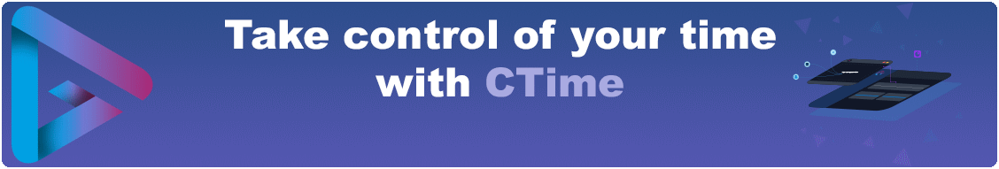

Hello there, Time Traveller! You've just found yourself at Creadigme, where we're always learning, always exploring, creating time-centric SaaS (Software as a Service) solutions in our quest to better understand the intertwining paths of business efficiency and personal fulfillment.

Traveller, you can discover our SaaS solution, [Creadigme CTime](https://creadigme.net), the Time Tracking reimagined, at https://creadigme.net.

## Our Timeless Mission

At Creadigme, we're on a mission; a journey, really, that's all about making a difference - in businesses, in people's lives. We're designing SaaS solutions that aim to demystify the complex labyrinth of work, reducing stress, and making space for individuals and teams to focus on the things that matter most to them.

As we piece together software to gently transform workflows, fine-tune customer interactions, and help make sense of time management, we're building bridges to positive change. We're dreaming of a future where work feels more like a dance with life, a ballet where time, often a relentless conductor, becomes a friendlier companion to everyone in their pursuit of productivity and satisfaction.

## Our Open Source Adventures

But there's more to our journey than just crafting SaaS solutions. We also believe in the magic that happens when knowledge is shared and the open-source community comes together. That's why we're not keeping our explorations to ourselves:

- **[Aurelia Docgen](https://github.com/creadigme/aurelia-docgen)**
- **[Aurelia I18N Audit](https://github.com/creadigme/aurelia-i18n-audit)**

And if you're curious about the other trails we're treading, feel free to wander into our other repositories.

## Connect Across Time and Space

We're never too far, never too busy to connect:

- [**Contact us**](https://creadigme.net/contact)
- [**LinkedIn**](https://linkedin.com/company/creadigme)
<!-- - [**Twitter**](https://twitter/Creadigme) -->

---

We're all explorers, learners, dreamers here. Come, join us in this grand adventure through the vast expanse of time and the thrilling realms of digital innovation!

"Time will tell. It always does."

© 2023 [Creadigme](https://creadigme.net). All rights reserved.
